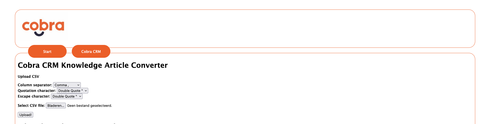
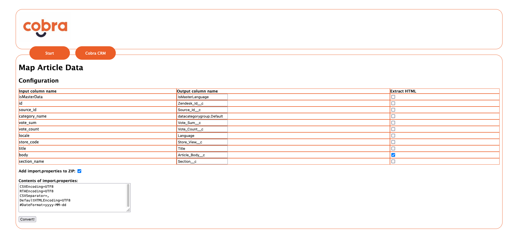
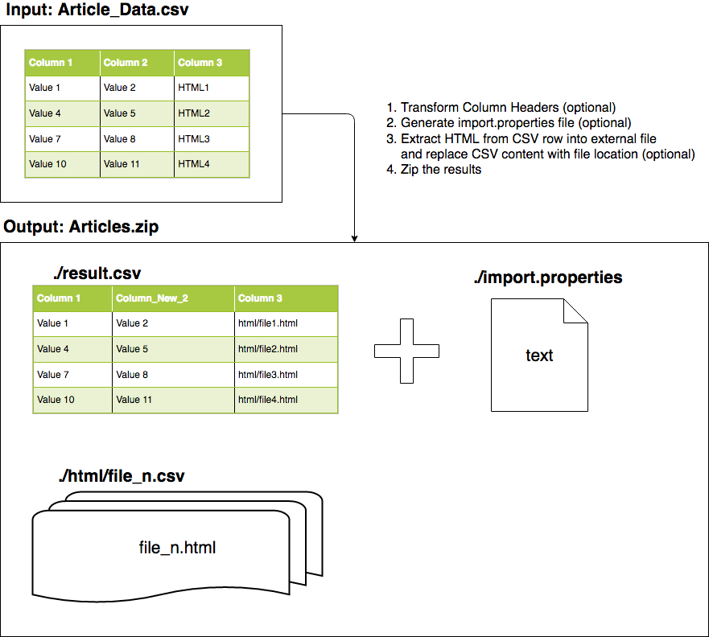

# Knowledge Article Convertor
Converts a CSV containing the HTML of knowledge articles, to a zip file containing import.properties for use in the Salesforce Article Import feature.

Extracts HTML values in separate files and an updated CSV where the original HTML has been replaced with references to the HTML files in the zip. 

Also allows remapping of column headers from the original CSV.

## Installation instructions
1. Install node (https://nodejs.org/en/download)
2. Clone this git repo

```$ git clone https://github.com/HKOLWD/kaconvertor.git```

3. Change to directory repo was cloned into and Run npm install
   
```$ npm install```

4. Start kaconvertor:

```$ node ./bin/www```

5. Open http://localhost:3000 in browser

## Usage
### Step 1


- Set the CSV properties for Column separator, Quotation character and Escape character for the source CSV file. 
- Select the source CSV file
- Press upload!


### Step 2


- Select the columns that contain HTML (check the "Extract HTML" box for those columns).

Optional:
- Edit column headers to match fields on the target Knowledge object
- Modify import.properties values (defaults should be fine to import articles+translations)

Press Convert!

### Step 3
Download zip file and upload in Salesforce setup, under "Import articles" 

## Schematic representation


